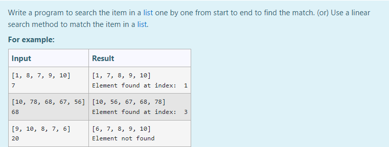
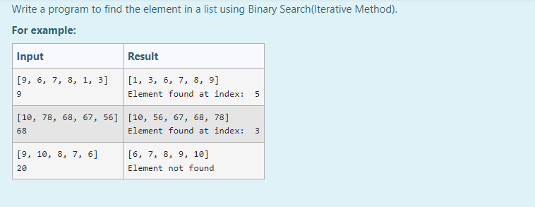
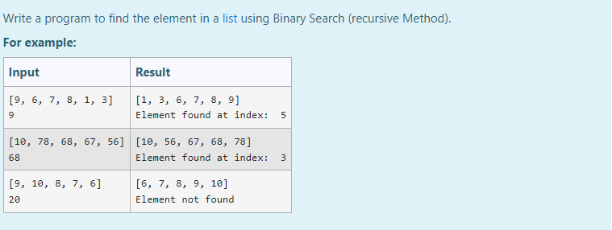
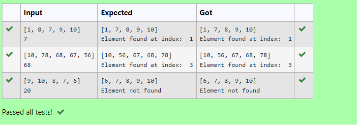
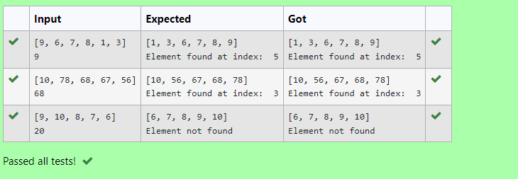

# Linear Search and Binary search
## Aim:
To write a program to perform linear search and binary search using python programming.
## Equipment’s required:
1.	Hardware – PCs
2.	Anaconda – Python 3.7 Installation / Moodle-Code Runner
## Algorithm:
## Linear Search:
1.	Start from the leftmost element of array[] and compare k with each element of array[] one by one.
2.	If k matches with an element in array[] , return the index.
3.	If k doesn’t match with any of elements in array[], return -1 or element not found.
## Binary Search:
1.	Set two pointers low and high at the lowest and the highest positions respectively.
2.	Find the middle element mid of the array ie. arr[(low + high)/2]
3.	If x == mid, then return mid.Else, compare the element to be searched with m.
4.	If x > mid, compare x with the middle element of the elements on the right side of mid. This is done by setting low to low = mid + 1.
5.	Else, compare x with the middle element of the elements on the left side of mid. This is done by setting high to high = mid - 1.
6.	Repeat steps 2 to 5 until low meets high
## Program:
i)	#Use a linear search method to match the item in a list.
~~~
Program for linear search method to match the item in a list
Developed by: SYED MUHAMMED ZAHI
RegisterNumber: 2140029

def linearSearch(array,n,k):
    # write your code for linear search
    for i in range(0, n):  
        if (array[i] == k):  
            return i  
    return -1  
  
array = eval(input())
# sort the array
k = eval(input()) # k-item to be seared for
# get the length of array and store in the variable n
n = len(array)
array.sort()
res = linearSearch(array, n,k)  
if(res == -1):  
    print(array)
    print("Element not found")  
else:  
    print(array)
    print("Element found at index: ", res) 
~~~
ii)	# Find the element in a list using Binary Search(Iterative Method).
~~~
Program to find the element in a list using Binary Search (Iterative Method).
Developed by: SYED MUHAMMED ZAHI
RegisterNumber:21004029
def binarySearch(array, k, low, high):
# Check base case
    if low>= k:
        mid = k+ (low- k) // 2
# If element is present at the middle itself
        if array[mid]== high:
            return mid
# If element is smaller than mid, then it
# can only be present in left subarray
        elif array[mid] >high:
            return binarySearch(array, k, mid-1, high)
# Else the element can only be present
# in right subarray
        else:
            return binarySearch(array, mid + 1, low, high)
    else:
        # Element is not present in the array
        return -1
#  Code
array = eval(input())
high=eval(input())
array.sort()
# Function call
result = binarySearch(array, 0, len(array)-1, high)
if result != -1:
    print(array)
    print("Element found at index: % d" % result)
else:
    print(array)
    print("Element not found")
~~~
iii)	# Find the element in a list using Binary Search (recursive Method).
~~~
Program to find the element in a list using Binary Search (recursive Method).
Developed by: SYED MUHAMMED ZAHI
RegisterNumber:21004029
def binarySearch(nums, target):
 # search space is nums[left…right]
    (left, right) = (0, len(nums) - 1)
 # loop till the search space is exhausted
    while left <= right:
 # find the mid-value in the search space and
 # compares it with the target
        mid = (left + right) // 2
 # overflow can happen. Use:
 # mid = left + (right - left) / 2
 # mid = right - (right - left) // 2
 # target is found
        if target == nums[mid]:
            return mid
 # discard all elements in the right search space,
 # including the middle element
        elif target < nums[mid]:
            right = mid - 1
 
 # discard all elements in the left search space,
 # including the middle element
        else:
            left = mid + 1
 # `target` doesn't exist in the list
    return -1
 if __name__ == '__main__':
    nums=eval(input())
    target =eval(input())
    nums.sort()
    index = binarySearch(nums, target)
    if index != -1:
        print(nums)
        print('Element found at index:',"",index)
    else:
        print(nums)
        print('Element not found')
~~~~
## Sample Input:
#1)Use a linear search method to match the item in a list.

#2)Find the element in a list using Binary Search(Iterative Method).

#3)Find the element in a list using Binary Search(recursive Method).

## OUTPUT:
#1)Use a linear search method to match the item in a list.

#2)Find the element in a list using Binary Search(Iterative Method).

#3)Find the element in a list using Binary Search(recursive Method).

## Result
Thus the linear search and binary search algorithm is implemented using python programming.
